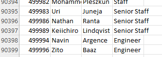
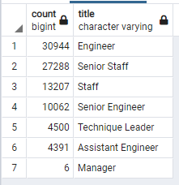
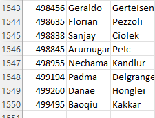

# Pewlett-Hackard-Analysis

## Overview
The purpose of this analysis was to help Bobby determine the number of retiring employees per title and identify those employees who are eligible to participate in a mentorship program. This data will help Bobby's manager prepare for the up coming wave of retiring employees.

## Results
Below is a list of four major points determined from the analysis:

* There are a total of 90,398 employees that are ready to retire

* The vast majority of personel who are ready to retire are either Engineers or Senior Staff

* 1549 current employees are eligible for the mentorship program

* Pewlett-Hackard will need to fill 30k in new engineering position as shown in the first figure

## Summary

Pewlett-Hackard will need to fill 90K position with the majority being in engineering as shown in figure 2. This will likely begin to impact development of new products by either having a stagnant product introductions with low to no inovations to manufacturing delays.

In terms of training the next generation, there are enough retirement-ready employees in all departments to help mentor new or current employees. With roughly 1,500 current employees eligible for advanced mentorship (as shown in figure 3), there is enough knowledge-base to get these employees ready for advanced/senior roles. However, the company will need to focus heavily on recuitment of fresh or seasoned talent in order to fill 90K future vacancies (as shown in figure 1).
